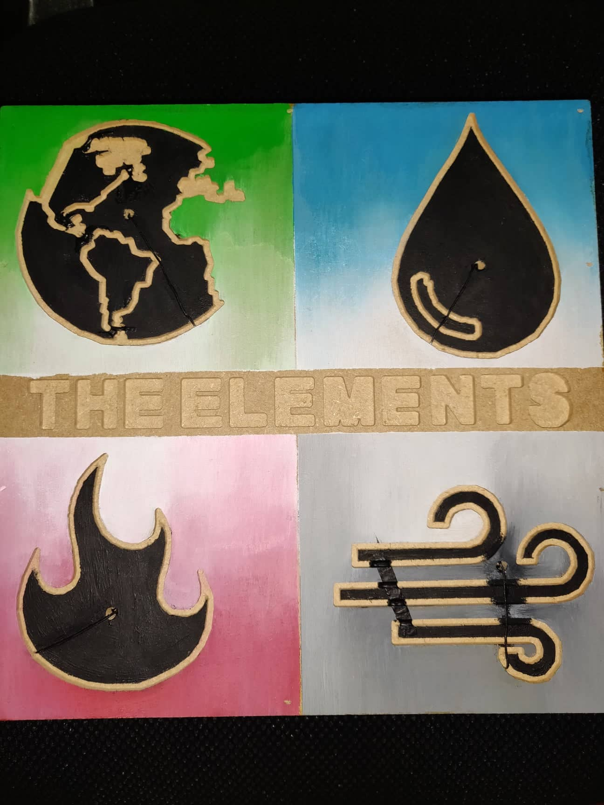
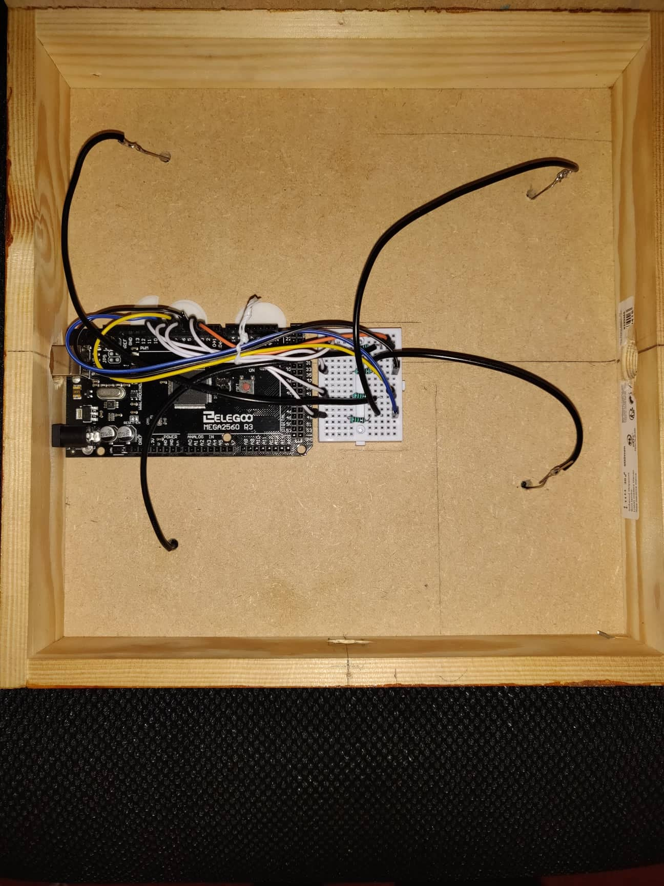
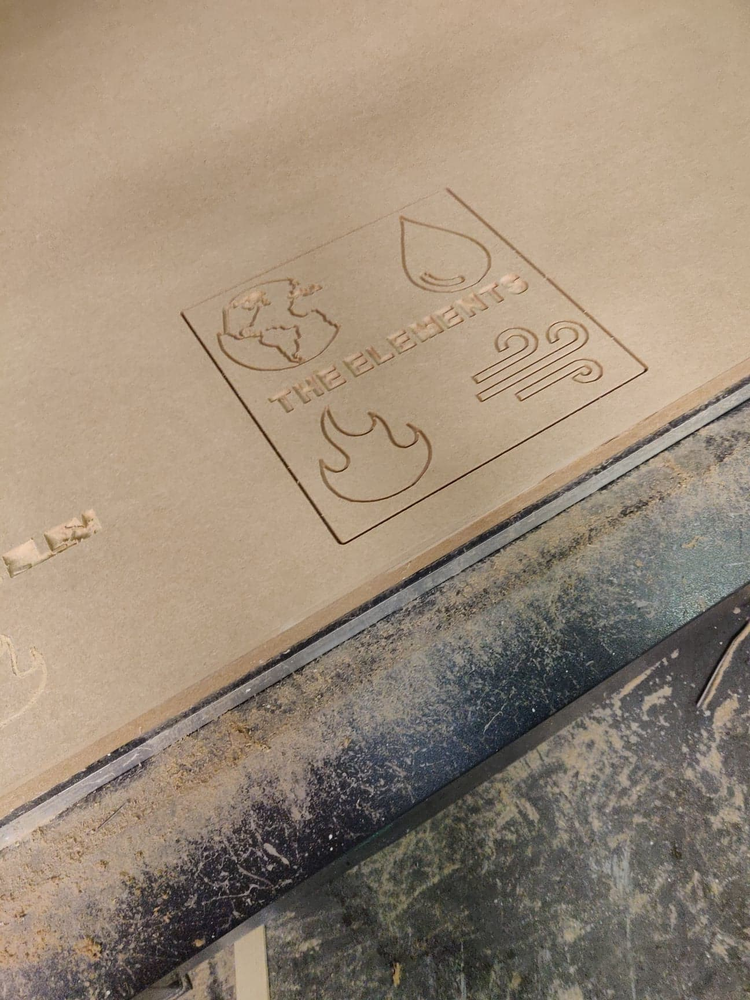

# interactive-album-capactive-touch-sensor

# Elements: Interactive Album Installation

.jpg)

## Overview

Elements is an interactive music installation that reimagines the traditional album format through physical interaction.

Inspired by the four classical elements — Earth, Water, Fire, and Air — the project allows listeners to control and blend four synchronized audio tracks using a custom-built capacitive touch interface.

Rather than passively listening to a fixed composition, users become active participants, dynamically shaping the balance and intensity of the music through touch.

---

## Demonstration

### Final Installation

### Electronics

### Fabrication

---

## Features

* Four capacitive touch sensors
* Real-time volume control
* Simultaneous playback of four audio tracks
* Interactive physical artwork
* Custom Arduino firmware
* Max/MSP audio engine
* CNC-fabricated enclosure
* Original field recordings and sound design
* Custom Software Design

---

## Technologies Used

### Hardware

* Arduino Mega
* CapacitiveSensor Library
* Breadboard Circuit Design
* Bare Conductive Paint
* CNC Machining

### Software

* Arduino IDE
* Max/MSP
* Logic Pro X
* Adobe Photoshop

### Audio Production

* Field Recording
* Sound Design
* Mixing
* Mastering

---

## System Architecture

User
  ↓
Capacitive Touch Artwork
  ↓
Arduino Uno
  ↓ Serial Communication
Max/MSP
  ↓
Audio Engine
  ↓
Earth | Water | Fire | Air

For a detailed technical explanation see:

* docs/technical-overview.md
* docs/architecture.md

---

## Repository Structure

interactive-album-capactive-touch-sensor/
│
├── firmware/
├── max-msp/
├── hardware/
├── docs/
├── assets/
├── README.md
└── LICENSE

### Firmware

Contains the Arduino firmware responsible for capacitive sensing and serial communication & breadboard layout.

### Max/MSP

Contains the audio engine, interaction logic, and media resources.

### Hardware

Contains CNC assets.

### Assets

Contains artwork, photographs and audio.

### Documentation

Contains technical documentation, architecture notes, build instructions, user manual, and the complete project report.

---

## Technical Challenges

### Capacitive Touch Sensing

The CapacitiveSensor library was modified and adapted to support four simultaneous sensor inputs and reliable data transmission to Max/MSP.

### Hardware Reliability

Several hardware iterations were explored before arriving at a stable breadboard-based design capable of producing consistent sensor readings.

### Interactive Audio Design

The four musical elements were composed and arranged so they could be played simultaneously while remaining harmonically compatible.

---

## What I Learned

This project provided experience in:

* Embedded Systems Development
* Physical Computing
* Serial Communication
* Human-Computer Interaction
* Audio Production
* Hardware Fabrication
* Creative Coding
* System Integration

---

## Documentation

Additional documentation is available in the `docs/` folder:

* Technical Overview
* Architecture Documentation
* Build Guide
* User Manual
* Full Project Report

---

## Author

Developed as an experimental interactive music project exploring the intersection of physical computing, audio production, and user interaction.
